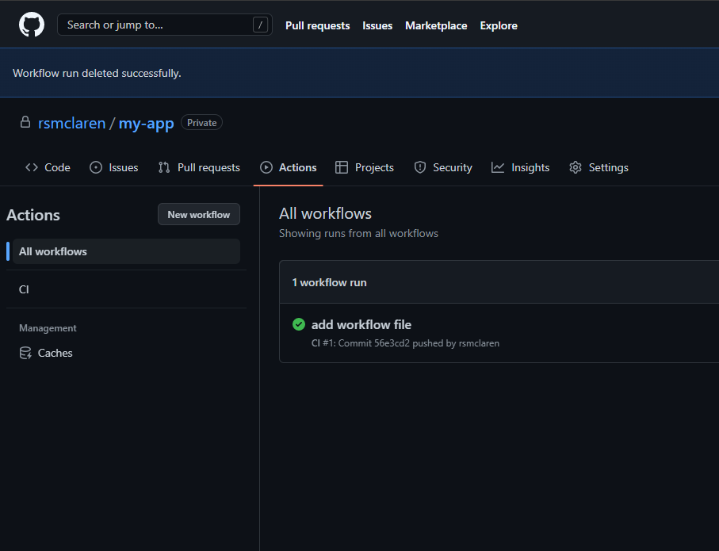
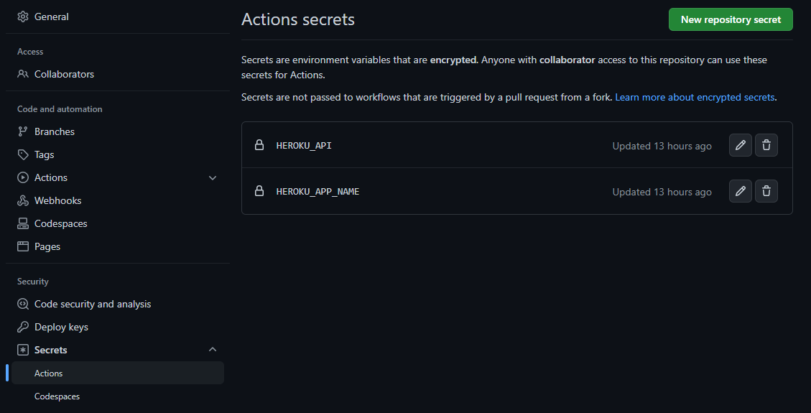

# github-actions-tutorial

CI/CD Pipeline demo using GitHub actions

### initial setup

- Install nodeJS: https://nodejs.org/en/
- Install VSCode: https://code.visualstudio.com/
- A GitHub account

### Instructions

We must first create a project. Open your command line and run

```
npx create-react-app github-ci
```

this will create a folder called github-ci containing a basic react app

You can run your application using the following command from the root of the project

```
npm start
```

Next we will create a repository on github for our react project

Open your project in VSCode, navigate to the Source Control tab and initialize a repo. Do your first commit, and push your repo to Github. You can use a private or public repo.

The next step is to create our Actions (workflow). The actions must be created inside a .github/workflow folder

Run the command below to create the directory structure

```
mkdir .github/
mkdir .github/workflows/
```

Next create your workflow files. Create a `ci.yml` file inside of the .github/workflows directory and paste the following snippet

```
name: CI

on: [push]

jobs:
  build:

    runs-on: ubuntu-latest

    steps:
    - uses: actions/checkout@v1
    - name: Run a one-line script
      run: echo Hello, world!
    - name: Run a multi-line script
      run: |
        echo Add other actions to build,
        echo test, and deploy your project.
```

**name: CI**

A name for our workflow

**on: [push]**

The on command is used to specify an event that will trigger the workflow, this event can be push, pull_request, etc. It can also be an array of events like this.

```
# Use an array when using more than one event
on: [push, pull_request]
```

**jobs:**
Here we are specifying the job we want to run, in this case, we are setting up a build job

**runs-on: ubuntu-latest**

The runs-on is specifying the OS you want your workflow to run on and we are using the latest version of ubuntu

**Steps:**

Steps just indicate the various steps you want to run on that job

**uses: actions/checkout@v1**

Github has some already define Actions, we are using version 1 of the checkout action this is responsible for cloning the repo and checking into our project directory.

The other steps just show how to run one or more commands in the shell. the default shell is bash.

## Let's test our workflow

Run the commands below to push your code to GitHub

```
git add .
git commit -m "Add workflow file"
git push origin -u master
```

Click on the Actions tab on your repo homepage to view your pipeline.



## Create an app on Heroku

Next we must create a heroku account and install the Heroku CLI.

- Heroku homepage: https://www.heroku.com/
- Heroku CLI: https://devcenter.heroku.com/articles/heroku-cli

After installing the Heroku CLI restart VScode. Open a terminal in VSCode and run the following commands

```
heroku create [your-W-number]github-ci --buildpack mars/create-react-app
```

replace `[your-W-number]` with your W number e.g w0136522github-ci

and then run

```
heroku stack:set heroku-20
```

Let's make our first deployment to Heroku. In your terminal run

```
git push heroku master
```

This does a push to the Heroku origin (A repo can have multiple origin)

Ensure deployment to heroku was successful by checking the Heroku URL. You can find this in the Heroku dashboard

## Continue work on our pipeline.

Replace the `on: push` section with the below

```
on:
  push:
    branches:
      - master
```

From the snippet above, we are saying that the workflow (pipeline) should be triggered only when we push to master branch (you can trigger the workflow on any branch).

Replace the job section with the snippet below

```
jobs:
  build:
    runs-on: ubuntu-latest

    strategy:
      matrix:
        node-version: [16.x]
```

We added a new section called strategy and under that, we are using a matrix accompanied with the node versions. What that section is doing is telling our workflow to run our build on version 16.x but we could include additional versions if wanted

```
    matrix:
      node-version: [16.x, 14.x]
```

Next, replace the steps section with the snippet below

```
    steps:
    - uses: actions/checkout@v1
    - name: Use Node.js ${{ matrix.node-version }}
      uses: actions/setup-node@v1
      with:
        node-version: ${{ matrix.node-version }}
```

Here we added the setup-node@v1 actions, this is responsible for installing the specified version of node in our CI environment. Since we are using the matrix strategy, and if we specified more than one version this could spin up multiple environments for each node version we specified.

Now let's add the different steps that will run in our CI

```
- name: npm install
        run: |
          npm install
      - name: npm test
        run: |
          npm test
        env:
          CI: true

      - name: npm build
        run: |
          npm run build --if-present
```

This tells our build to run `npm install`, `npm test`, and `npm run build`

By now our Pipeline should look like this

```
name: CI

on:
  push:
    branches:
      - master

jobs:
  build:
    runs-on: ubuntu-latest

    strategy:
      matrix:
        node-version: [16.x]

    steps:
      - uses: actions/checkout@v1
      - name: Use Node.js ${{ matrix.node-version }}
        uses: actions/setup-node@v1
        with:
          node-version: ${{ matrix.node-version }}

      - name: npm install
        run: |
          npm install
      - name: npm test
        run: |
          npm test
        env:
          CI: true

      - name: npm build
        run: |
          npm run build --if-present
```

## Add environment variables

We need to add our Heroku API key and Heroku app name to your Github repo.

Go to your Heroku dashboard and click on account settings locate your API key and copy it. Go to settings tab on your GitHub repository and click on secrets and add you Heroku api key, also do the same for your app name (In our case, our app name when we created the app on Herokus is github-ci)



our secrets are HEROK_API and HEROKU_APP_NAME

to access these variables in our pipeline we have to use the format below

```
${{ secrets.HEROKU_API }}
${{ secrets.HEROKU_APP_NAME }}
```

## Deploy to Heroku

Add the snippet below to deploy your code to Heroku

```
    - name: Add remote origin
      run: |
        git remote add heroku https://heroku:${{ secrets.HEROKU_API }}@git.heroku.com/${{ secrets.HEROKU_APP_NAME }}.git
    - name: Deploy to Heroku
      run: |
        git push heroku HEAD:master -f
```

The section is responsible for deploying the code to Heroku.

The complete pipeline should look like this

```
name: CI

on:
  push:
    branches:
      - master

jobs:
  build:
    runs-on: ubuntu-latest

    strategy:
      matrix:
        node-version: [16.x]

    steps:
      - uses: actions/checkout@v1
      - name: Use Node.js ${{ matrix.node-version }}
        uses: actions/setup-node@v1
        with:
          node-version: ${{ matrix.node-version }}

      - name: npm install
        run: |
          npm install
      - name: npm test
        run: |
          npm test
        env:
          CI: true

      - name: npm build
        run: |
          npm run build --if-present

      - name: Add remote origin
        run: |
          git remote add heroku https://heroku:${{ secrets.HEROKU_API }}@git.heroku.com/${{ secrets.HEROKU_APP_NAME }}.git
      - name: Deploy to Heroku
        run: |
          git push heroku HEAD:master -f
```

commit your code and push to master. Navigate back to your Actions tab on your repo in Github and you should see your pipeline running

Adapted from: https://medium.com/@michaelekpang/creating-a-ci-cd-pipeline-using-github-actions-b65bb248edfe
